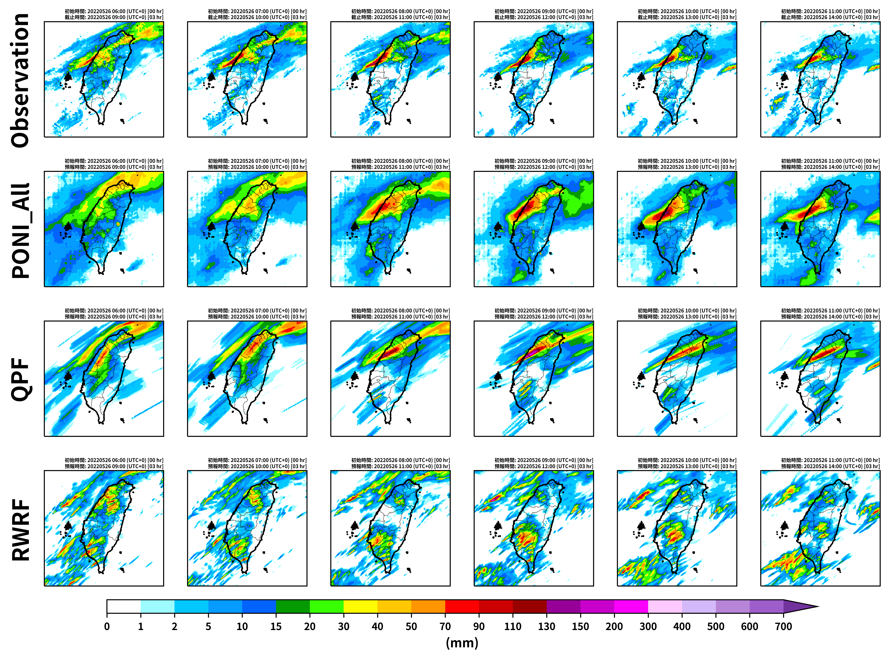

## The DeepQPF-PONI Model Codebase

This repository contains the DeepQPF-PONI model, trained with _rain rate (mm/h)_, _radar reflectivity (dBZ)_, and _heterogeneous weather data_. The model input incorporates _QPESUMS rain rate_, _column value (CV)_, and environment variables from _ERA5_. 
It is designed to predict accumulated hourly rainfall with a lead time of three hours.


_Fig. 1. Comparison of 3-h accumulated rainfall (mm; color bar) predictions in the case of heavy rainfall caused by a mesoscale convective system during 06:00 – 14:00 UTC 26 MAY 2022 for the PONI_All model, QPESUMS extrapolation, and the numerical model RWRF._

### How to build the environment
``` python=1
# update conda in base env
conda update conda

# create a new env for this project
conda create --name deepQPF-PONI

# turn off the auto-activate
conda config --set auto_activate_base false

# activate env
conda activate deepQPF-PONI

# install packages
conda install -c conda-forge jupyterlab
conda install pytorch torchvision torchaudio cudatoolkit=11.3 -c pytorch
pip3 install geopandas
conda install -c anaconda netcdf4 -y
conda install -c conda-forge matplotlib -y
conda install -c conda-forge cartopy -y
conda install -c conda-forge cmaps -y
pip install scipy
pip install pytorch-lightning # version==1.6.3
pip install pytorch-msssim
pip install test-tube
pip install wget
pip install metpy
pip install tqdm
pip install wandb
pip install python-crontab

pip install cdsapi # for EC climate data
conda install -c anaconda basemap -y
```
### Locally connected network
Since PyTorch 1.6.3 **does NOT** include locally connected network algorithms, users need to manually add the `Conv2dLocal` module to the PyTorch source code. Please refer to the [pull request](https://github.com/pytorch/pytorch/pull/1583/files) for detailed instructions and code implementation.

### Get started with inference

1. Please find ``` 0_fast_eval.ipynb ``` in ```"DLRA/evaluation"```
2. Create data directories at your work station: ```"/data/DLRA_database/PKL_2Drd_rain10m"``` & ```"/data/DLRA_database/ERA5_reanalysis"```
3. Reset ```os.environ['ROOT_DATA_DIR']``` in the following format: ```"[Your work dir]/"```


